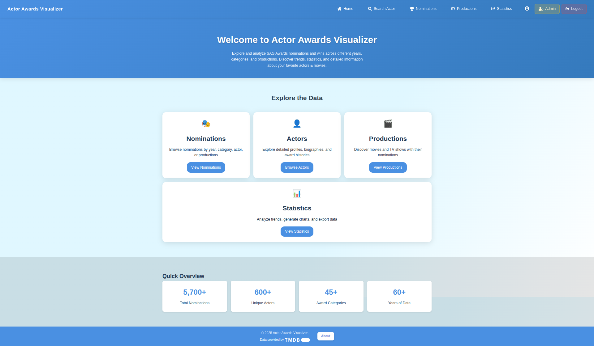

# ActorAwardsVisualizer

**A PHP web app for exploring Screen Actors Guild Award winners**  
Browse nominations, productions, actor profiles, and interactive stats. Powered by TMDB, Chart.js, and SQLite.

---

## Table of Contents

1. [Demo](#demo)
2. [Features](#features)
3. [Tech Stack](#tech-stack)
4. [Getting Started](#getting-started)
   - [Prerequisites](#prerequisites)
   - [Installation](#installation)
   - [Configuration](#configuration)
   - [Database Setup](#database-setup)
   - [Running Locally](#running-locally)
5. [Project Structure](#project-structure)
6. [Quality & Testing](#quality--testing)
7. [License](#license)
8. [Authors](#authors)
9. [Acknowledgments](#acknowledgments)

---

## Demo

  
*More screenshots inside /documentation/screenshots*

> **Live Preview:** https://actorawards.dev.denishub.com/

---

## Features

- **Home Dashboard**: Quick overview of total: nominations, unique actors, categories, years of data.
- **Nominations Browser**: Filter by year, category, actor, or production.
- **Actor Profiles**: Bio, SAG history, news via Google News RSS.
- **Production Browser**: Filter by year, category, results (win/nominated) or production title.
- **Statistics charts**:
  - Nominations by category
  - Top nominated actors with images
  - Yearly nomination trends
  - Top productions with posters  
  Exportable as CSV, SVG or WebP.
- **Admin Panel**:
  - User management with role-based access control
  - System health monitoring (disk, memory usage)
  - Database and media backup tools
  - System logs monitoring (error & access logs)
- **Authentication & Security**:
  - User registration, login, password reset via email
  - CSRF protection on all forms
  - Password hashing with PHP's built-in functions
  - Role-based access control (user/admin)
  - Session management with secure cookies

---

## Tech Stack

- **Backend**: PHP 8.1+, SQLite (PDO), Composer
- **Frontend**: HTML5, CSS3, JavaScript
  - Chart.js (via CDN)
  - Font Awesome (via CDN)
- **APIs & Libraries**:
  - TMDB API (actor/production data)
  - `vlucas/phpdotenv` (env vars)
  - `intervention/image` (image processing)
  - `phenx/php-svg-lib` & `rosell-dk/webp-convert` (SVG/WebP export)
  - `phpmailer/phpmailer` (email)
- **Deployment**: Docker & docker-compose

---

## Getting Started

### Prerequisites

- PHP 8.1 or higher
- Composer
- Docker (optional, for containerized setup)

### Installation

1. **Clone the repo**
   ```bash
   git clone https://github.com/denisturcanu84/ActorAwardsVisualizer.git
   cd ActorAwardsVisualizer
   ```

2. **Install PHP dependencies**
   ```bash
   composer install
   ```

3. **Set up environment**
   ```bash
   cp .env.example .env
   ```
   
   Then edit `.env` to add your TMDB API key and database path.

### Configuration

Edit your `.env` file with the following settings:

```dotenv
# TMDB API Configuration
TMDB_API_KEY=your_api_key_here
TMDB_API_BASE_URL=https://api.themoviedb.org/3

# Database Configuration
DATABASE_PATH=database/app.db
CSV_PATH=csv/screen_actor_guild_awards.csv

# Email Configuration (for password reset)
SMTP_HOST=smtp.gmail.com
SMTP_PORT=587
SMTP_USERNAME=your_email@gmail.com
SMTP_PASSWORD="your_app_password"
SMTP_ENCRYPTION=tls
SMTP_FROM_EMAIL=your_email@gmail.com
SMTP_FROM_NAME="Actor Awards Visualizer"

# Application Settings
APP_NAME="Actor Awards Visualizer"
APP_URL=http://localhost:8000
```

### Database Setup

The application uses SQLite with a pre-populated database containing SAG Awards data until 2020.

**Database Structure:**
- `awards` - Main table with nominations/wins data
- `actors` - Actor profiles from TMDB API
- `productions` - Movies/TV shows information
- `users` - User authentication and roles
- `actor_statistics` - Cached statistics for performance
- `password_resets` - Password reset tokens

**Initial Setup:**
1. The database file `database/app.db` is included in the repository
2. Contains ~5,700 SAG Award nominations from 1995-2020
3. Actors and productions are populated automatically via TMDB API when accessed
4. Database schema is available in `database/schema.sql`

**Admin User:**
- Default admin credentials are created on first run

### Running Locally

```bash
php -S localhost:8000 -t public
```

Open [http://localhost:8000](http://localhost:8000) in your browser.

**With Docker:**

```bash
docker-compose up --build
```

Then visit [http://localhost:30112](http://localhost:30112).

---

## Project Structure

```
ActorAwardsVisualizer/
├── composer.json              # PHP dependencies & autoloader
├── docker-compose.yml         # Docker Container setup
├── Dockerfile                 # Docker Container build instructions
├── .env.example               
├── csv/                       # SAG Awards data CSV
│   └── screen_actor_guild_awards.csv
├── database/                  # SQLite DB
│   └── app.db
├── diagrams/                  # System architecture diagrams
├── documentation/             # Performance tests & screenshots
├── public/                    # Web-accessible files
│   ├── index.php
│   ├── assets/               # CSS, JS, images
│   ├── pages/
│   └── admin/
├── src/                       # Backend source code
│   ├── bootstrap.php
│   ├── Services/
│   ├── Repositories/
│   ├── Middleware/
│   ├── Utils/
│   ├── Views/
│   ├── Exports/
│   └── Admin/
└── vendor/                    # Composer dependencies
```

---

## Quality & Testing

### Performance Testing

Lighthouse reports in `documentation/LightHouse Tests/` (desktop & mobile PDFs).

### Screenshots

See `documentation/screenshots/` for all interface images.

### Validation & Security

| Check              | Tool          | Link                                                                                                      |
|--------------------|---------------|-----------------------------------------------------------------------------------------------------------|
| CSS validation     | W3C CSS       | [Validator](https://jigsaw.w3.org/css-validator/validator?uri=https%3A%2F%2Factorawards.dev.denishub.com)      |
| Vulnerability scan | Pentest-Tools | [Report](https://pentest-tools.com/website-vulnerability-scanning/website-scanner/scans/tIyyJgbcWVUwMj0j) |

---

## License

This project is licensed under the **MIT License**. See [LICENSE](LICENSE) for details.

---

## Authors

- **Denis Rafael Turcanu**
- **Ioan-Lucian Meraru**

---

##  Acknowledgments

- [TMDB API](https://www.themoviedb.org/documentation/api)
- [Chart.js](https://www.chartjs.org/)
- [Font Awesome](https://fontawesome.com/)
